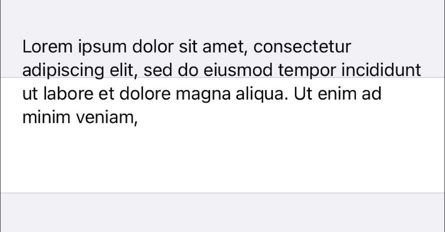

# MultilineTextRow

TextRow configuration: 

```swift
 let textRow = TextRow() {
      $0.tag = "TextRow"
      $0.cellStyle = .subtitle
      $0.title = "Lorem ipsum dolor sit amet, consectetur adipiscing elit, sed do eiusmod tempor incididunt ut labore et dolore magna aliqua. Ut enim ad minim veniam,"
      $0.cell.textLabel?.numberOfLines = 0
    }
```

Layout problem:


